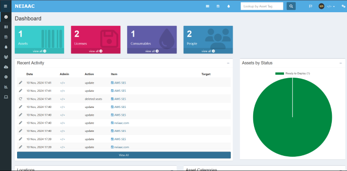

# Keeping things organized 📦🧹



## Requirements 📋

- Docker Engine 25.0.0+
- Docker Compose 2.24.0+

## Usage 🚀

- Clone the repository and open a terminal **inside** it.

- Create a `.env` file based on the `.env.example` file.

- Start the docker compose:

  ```shell
  docker compose up --force-recreate
  ```

- Access Snipe-IT at the port you set in the `.env` file, the initial setup page will be shown on the first run.

## Notes 📝

- To update any of the docker services simply bump the versions in the `image` fields of the `docker-compose.yaml` file and run the `docker compose up --force-recreate` command to restart them with the new version, data will be persisted through the volumes.

- Always beware of **breaking changes** when editing the version field in the `docker-compose.yaml` file! Look at the update notes of each component to see if there are any migration steps required when upgrading, Snipe-IT usually mentions any required steps in their [release notes](https://github.com/snipe/snipe-it/releases) page.
